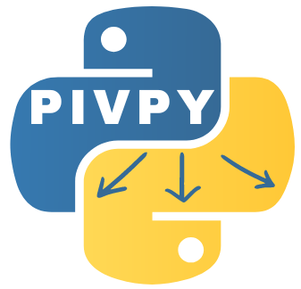

#   PIVPy 

Python based post-processing PIV data analysis


[](https://badge.fury.io/py/pivpy)
[](https://pivpy.readthedocs.io/en/latest/?badge=latest)
[](https://mybinder.org/v2/gh/alexlib/pivpy/master?filepath=examples%2Fnotebooks%2FGetting_Started.ipynb)


Merging the three packages: 
1. https://github.com/tomerast/Vecpy
2. https://github.com/alexlib/pivpy/tree/xarray
3. https://github.com/ronshnapp/vecpy


## How do I get set up?

Recommended: use `uv` (fast, reproducible)  

Create a virtualenv and install:

    uv venv
    uv pip install pivpy

Install with optional dependencies (including `lvpyio` for LaVision VC7):

    uv pip install 'pivpy[full]'

Alternative: use `pip`:

    pip install pivpy

or with optional dependencies:

    pip install 'pivpy[full]'

if you use OpenPIV, PIVlab, etc. 

Quick start (auto-detect file format):

    from pivpy import io
    ds = io.read_piv('your_file.vec')

Legacy loaders (still supported):

    ds = io.load_vec('your_file.vec')
    ds = io.load_openpiv_txt('your_file.txt')

Check whether a newer version is available on PyPI:

    import pivpy
    res = pivpy.check_update(verbose=True)
    # res.status: 0=unavailable, 1=up-to-date, 2=update available, 3=installed newer

## PIVMat-inspired methods

PIVPy exposes many post-processing operations via the xarray accessor `Dataset.piv`.
Several common PIVMat toolbox methods are available with similar names/behavior:

    import pivpy.pivpy  # registers the .piv accessor
    from pivpy import io

    ds = io.create_sample_Dataset(n_frames=10)

    # Add noise (similar to PIVMat addnoisef)
    ds_noisy = ds.copy().piv.addnoisef(eps=0.1, opt='add', nc=0.0, seed=0)

    # Ensemble (temporal) average and optional std/rms (similar to PIVMat averf)
    avg = ds.piv.averf()
    avg, std, rms = ds.piv.averf(return_std_rms=True)

    # Spatial averages (similar to PIVMat spaverf)
    ds_xy = ds.piv.spaverf('xy')   # excludes zeros by default
    ds_x0 = ds.piv.spaverf('x0')   # include zeros

    # Subtract ensemble/spatial average (similar to PIVMat subaverf)
    fluct = ds.piv.subaverf('e')
    fluct_x = ds.piv.subaverf('x0')

    # Azimuthal averaging (similar to PIVMat azaverf)
    r, ur, ut = ds.isel(t=0).piv.azaverf(0.0, 0.0, return_profiles=True)

    # Temporal resampling and phase average (similar to PIVMat resamplef/phaseaverf)
    ds_r = ds.piv.resamplef(tini=range(ds.sizes['t']), tfin=[0.5, 1.5, 2.5])
    phased = ds.piv.phaseaverf(12)

Additional PIVMat-inspired utilities:

    # Correlation along a dimension (similar to PIVMat corrm/corrx)
    cu = ds.piv.corrm(variable='u', dim='x')        # returns DataArray with a 'lag' dimension
    cv = ds.piv.corrm(variable='v', dim='y', half=True)

    # Spatial correlation function + integral scales (similar to PIVMat corrf)
    cor = ds.piv.corrf(variable='u', dim='x', normalize=True)
    # correlation curve: cor['f'] over cor['r']
    # integral scales: cor['isinf'], cor['is5'], cor['is2'], cor['is1'], cor['is0']

    # Fill holes encoded as zeros (similar to PIVMat interpolat.m behavior)
    ds_filled = ds.piv.fill_zeros(max_iter=10)

    # Extract a rectangular region (similar to PIVMat extractf)
    sub = ds.piv.extractf([0.0, 0.0, 10.0, 5.0], 'phys')   # [x1,y1,x2,y2] in physical units
    sub = ds.piv.extractf([10, 5, 50, 40], 'mesh')         # 1-based mesh indices (MATLAB-like)

    # Spatial convolution filter (similar to PIVMat filterf)
    ds_smooth = ds.piv.filterf(1.0, 'gauss', 'same')   # keep same size
    ds_smooth_valid = ds.piv.filterf(1.0, 'gauss')     # smaller (conv2(...,'valid') behavior)

    # Flip field (similar to PIVMat flipf)
    ds_lr = ds.piv.flipf('x')     # left-right mirror (negates u)
    ds_tb = ds.piv.flipf('y')     # top-bottom mirror (negates v)
    ds_xy = ds.piv.flipf('xy')    # both

    # 2D Butterworth filter (similar to PIVMat bwfilterf)
    ds_low = ds.piv.bwfilterf(filtsize=3.0, order=8.0, mode='low', trunc=True)
    ds_high = ds.piv.bwfilterf(filtsize=3.0, order=8.0, mode='high')

    # PIVMat-style option wrapper: opts can include 'high'/'low'/'trunc'
    ds_high2 = ds.piv.bwfilterf_pm(3.0, 8.0, 'high', 'trunc')

    # Batch processing over filename series (similar to PIVMat batchf)
    # fun can be a callable (fun(ds, ...)) or an accessor method name (e.g. 'averf', 'bwfilterf')
    from pivpy.io import batchf
    results = batchf('pivpy/data/day2/day2a00500[0:5].T000.D000.P003.H001.L.vec', 'averf')

### For developers, local use:

Using `uv` (recommended):

    git clone https://github.com/alexlib/pivpy .
    cd pivpy
    uv venv
    uv pip install -e .

Editable install with optional dependencies:

    uv pip install -e '.[full]'

Alternative (conda):

    git clone https://github.com/alexlib/pivpy .
    cd pivpy
    conda create -n pivpy python=3.11
    conda activate pivpy
    conda install pip
    pip install -e .

   
## What packages are required and which are optional

1. `lvpyio` by Lavision Inc. if you use vc7 files
2. `netcdf4` if you want to store NetCDF4 files by xarray
3. `pyarrow` if you want to store parquet files
4. `vortexfitting` if you want to do vortex analysis ($\lambda_2$ and $Q$ criterions, vortex fitting) 
5. `numpy`, `scipy`, `matplotlib`, `xarray` are must and installed with the `pivpy`

 
## Contributors

1. @alexlib
2. @ronshnapp - original steps
3. @liorshig - LVreader and great visualizaiton for Lavision
4. @nepomnyi - connection to VortexFitting and new algorithms 

    
## How to get started?

Look into the [getting started Jupyter notebook](https://github.com/alexlib/pivpy/blob/master/examples/notebooks/Getting_Started.ipynb)

and additional notebooks:
[Notebooks](https://github.com/alexlib/pivpy/blob/master/examples/notebooks/)

## How to test?

From a command line just use:

    pytest

With `uv`:

    uv run pytest -q
    
## Documentation on Github

[PIVPy on ReadTheDocs](http://pivpy.readthedocs.io)

## How to help?

Read the ToDo file and pick one item to program. Use Fork-Develop-Pull Request model to 
contribute

## How to write tutorials and add those to the documentation

Using great tutorial http://sphinx-ipynb.readthedocs.org/en/latest/howto.html we now can 
prepare IPython notebooks (see in /docs/source) and convert those to .rst files, then 

    uv pip install -r docs/requirements.txt
    uv run sphinx-build -b html docs/source/ docs/build/html
    
generates ```docs/build/html``` directory with the documentation
