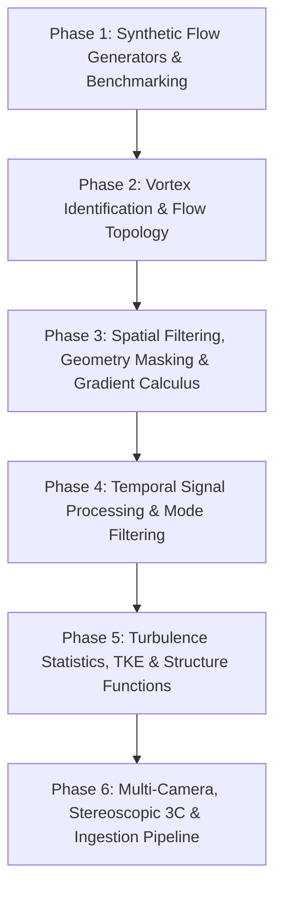

# PIVPy Development Roadmap: PIVMat Feature Parity & Modernization

## Overview

This roadmap defines the multi-phase evolution plan for **PIVPy**, inspired by the MATLAB **PIVMat 4.22** toolbox (F. Moisy), the Python **PyPostPiv** library (J. Hu et al., Univ. of Waterloo), and modernized for Python's scientific ecosystem (`xarray`, `zarr`, `dask`, `scipy`, `marimo`).

The goal is to establish PIVPy as the definitive, intuitive, out-of-core post-processing framework for Particle Image Velocimetry (PIV) and fluid dynamics research.

---

## Architectural Principles

1. **Pure Accessor Operations**: Accessor methods (`ds.piv.*`) must return a new `xarray.Dataset` (or DataArray/figure) rather than mutating datasets in-place.
2. **Canonical Schema Conformance**: All synthetic generators, transforms, and readers construct datasets via `pivpy.schema.build_dataset()` with standard dimensions `('y', 'x', 't')`, variables (`u`, `v`, `chc`, optional `w`), and metadata.
3. **Out-of-Core Scalability**: Heavy calculations (temporal reductions, structure functions, spectral transforms) must preserve or leverage Dask-backed chunking.
4. **PIVMat & PyPostPiv Parity with Pythonic Defaults**: Maintain PIVMat-compatible method aliases (e.g. `averf`, `filterf`, `interpf`, `corrf`) and PyPostPiv field calculus conventions (`tke`, `rms`, `fluctuations`, `circulation`) alongside readable Pythonic conventions.

---

## Phase Breakdown

---

### Phase 1: Synthetic Flow Generators & Benchmarking Suite

**Objective**: Provide analytical and stochastic vector flow fields for algorithm validation, automated testing, and educational notebooks without requiring external raw data files.

* **`vortex` ([`pivmat/vortex.m`](file:///C:/Users/alex/Github/pivmat/pivmat/vortex.m))**:
  * Implement analytical vortex models: Burgers, Lamb-Oseen, Rankine, and Vatistas vortices.
  * Configurable parameters: core radius $r_0$, circulation / peak vorticity $\omega_0$, core divergence $\gamma$, domain resolution, center position.
  * Target: `pivpy.synthetic.vortex(...)` & `io.create_vortex_dataset(...)`.
* **`multivortex` ([`pivmat/multivortex.m`](file:///C:/Users/alex/Github/pivmat/pivmat/multivortex.m))**:
  * Random spatial distribution of multiple Burgers/Lamb vortices simulating 2D synthetic turbulence.
  * Target: `pivpy.synthetic.multivortex(...)`.
* **`randvec` ([`pivmat/randvec.m`](file:///C:/Users/alex/Github/pivmat/pivmat/randvec.m))**:
  * Synthetic random velocity fields with prescribed power spectrum $E(k) \propto k^{-\alpha}$ or correlation length, optionally enforcing divergence-free ($\nabla \cdot \mathbf{u} = 0$) conditions.
  * Target: `pivpy.synthetic.randvec(...)`.
* **`makebospattern` ([`pivmat/makebospattern.m`](file:///C:/Users/alex/Github/pivmat/pivmat/makebospattern.m))**:
  * High-density random speckle/dot pattern generator for synthetic PIV and optical calibration.

---

### Phase 2: Vortex Identification Criteria & Flow Topology

**Objective**: Equip PIVPy with first-class vortex core tracking, rotational topology metrics, and frame-of-reference transformations.

* **Normalized Angular Momentum ($\Gamma_1$ & $\Gamma_2$) ([`pivmat/nam.m`](file:///C:/Users/alex/Github/pivmat/pivmat/nam.m))**:
  * Implement Graftieaux / Michard dimensionless vortex identification criteria:
    $$\Gamma_1(P) = \frac{1}{N} \sum_{S} \frac{(\mathbf{PM} \times \mathbf{u}_M) \cdot \hat{\mathbf{z}}}{\|\mathbf{PM}\| \|\mathbf{u}_M\|}$$
    $$\Gamma_2(P) = \frac{1}{N} \sum_{S} \frac{(\mathbf{PM} \times (\mathbf{u}_M - \bar{\mathbf{u}}_S)) \cdot \hat{\mathbf{z}}}{\|\mathbf{PM}\| \|\mathbf{u}_M - \bar{\mathbf{u}}_S\|}$$
  * Vectorized 2D window calculation over spatial grid.
  * Target: `ds.piv.gamma1(siz=3, name="gamma1")` and `ds.piv.gamma2(siz=3, name="gamma2")`.
* **Circulation-Based Vorticity (PyPostPiv & Raffel et al.)**:
  * Calculate vorticity via 8-point contour loop circulation integral $\Gamma = \oint \mathbf{u} \cdot d\mathbf{l}$ over grid cells ($\Delta A$), providing superior noise-robustness compared to raw differential approximations:
    $$\omega_{\text{circ}} = \frac{1}{\Delta A} \oint \mathbf{u} \cdot d\mathbf{l}$$
  * Target: `ds.piv.vorticity(method='differentiation' | 'circulation')`.
* **Solid-Body Rotation Subtraction ([`pivmat/subsbr.m`](file:///C:/Users/alex/Github/pivmat/pivmat/subsbr.m))**:
  * Subtract solid-body rotation $\mathbf{u} - \mathbf{\Omega} \times (\mathbf{r} - \mathbf{r}_0)$ around a localized vortex core $(x_0, y_0)$.
  * Target: `ds.piv.subsbr(center=(x0, y0), omega=None)`.
* **Vortex Invariants Suite**:
  * Add $Q$-criterion, Okubo-Weiss parameter ($Q_{OW} = S^2 - \omega^2$), and swirling strength ($\lambda_{ci}$).
  * Target: `ds.piv.q_criterion()`, `ds.piv.okubo_weiss()`.

---

### Phase 3: Spatial Filtering, Geometry Masking & Gradient Calculus

**Objective**: Handle complex experimental geometries, model boundaries, outlier cleaning, and robust spatial differentiation schemes.

* **High-Order & Robust Gradient Schemes (PyPostPiv)**:
  * Implement configurable finite-difference gradient operators ($\partial u/\partial x, \partial u/\partial y, \partial v/\partial x, \partial v/\partial y$) with options:
    * `2nd_central`: 2nd-order central difference with 1st-order forward/backward at boundaries.
    * `4th_central`: 4th-order central difference.
    * `least_squares`: Local polynomial / least-squares fit smoothing gradients.
  * Target: `ds.piv.derivatives(method='2nd_central'|'4th_central'|'least_squares')` and `ds.piv.gradient_tensor()`.
* **2D Spatial Median Filter ([`pivmat/medianf.m`](file:///C:/Users/alex/Github/pivmat/pivmat/medianf.m))**:
  * Robust spatial median filter with outlier vector detection and iterative replacement (standard PIV validation workflow).
  * Target: `ds.piv.medianf(size=3, niter=1)`.
* **Geometric Obstacle Masking ([`pivmat/circmaskf.m`](file:///C:/Users/alex/Github/pivmat/pivmat/circmaskf.m), `maskrectf.m`)**:
  * Mask circular, rectangular, or arbitrary polygon obstacles (e.g. cylinder, airfoil body) by marking `chc = 0` and masking $u, v$.
  * Target: `ds.piv.mask_circle(center, radius)`, `ds.piv.mask_rect(bounds)`, `ds.piv.mask_polygon(vertices)`.
* **Grid Remapping & Transforms ([`pivmat/remapf.m`](file:///C:/Users/alex/Github/pivmat/pivmat/remapf.m), `rotatef.m`, `flipf.m`)**:
  * `ds.piv.remap(new_x, new_y)`: 2D interpolation onto custom rectilinear meshes.
  * `ds.piv.rotate(angle, center=None)`: Arbitrary angle field rotation with bilinear interpolation.
  * `ds.piv.flip(axis='x'|'y')`: Mirroring across coordinate axes.

---

### Phase 4: Temporal Frequency Analysis & Modal Filtering

**Objective**: Facilitate unsteady and time-resolved PIV (TR-PIV) analysis, vortex shedding extraction, and noise rejection.

* **Fourier Temporal Bandpass / Notch Filtering ([`pivmat/tempfilterf.m`](file:///C:/Users/alex/Github/pivmat/pivmat/tempfilterf.m))**:
  * Apply FFT temporal filters along the $t$ dimension:
    * Bandpass filtering to isolate dominant shedding frequencies / acoustic modes.
    * Notch filtering (`mode='remove'`) to reject mechanical vibrations or laser pulse fluctuations.
    * Complex modal output support (spatial amplitude and phase distributions).
  * Target: `ds.piv.tempfilterf(freq_range=(f_low, f_high), mode='bandpass'|'remove')`.
* **Phase-Averaging Refinements ([`pivmat/phaseaverf.m`](file:///C:/Users/alex/Github/pivmat/pivmat/phaseaverf.m))**:
  * Phase-locked ensemble averaging over periodic flow cycles (oscillating foils, IC engine cycles, vortex streets).

---

### Phase 5: Turbulence Statistics, TKE & Structure Functions

**Objective**: Enable quantitative turbulence research with Reynolds decomposition, turbulent kinetic energy, and energy cascade scaling.

* **Turbulent Fluctuations, RMS & TKE (PyPostPiv & PIVMat)**:
  * Reynolds decomposition: $u' = u - \bar{u}$, $v' = v - \bar{v}$ (and $w' = w - \bar{w}$).
  * Root-mean-square velocity fields: $u_{\text{rms}} = \sqrt{\langle u'^2 \rangle}$, $v_{\text{rms}} = \sqrt{\langle v'^2 \rangle}$.
  * Turbulent Kinetic Energy (TKE):
    $$k = \frac{1}{2} \left( \langle u'^2 \rangle + \langle v'^2 \rangle + \langle w'^2 \rangle \right)$$
  * Target: `ds.piv.fluctuations()`, `ds.piv.rms()`, `ds.piv.tke()`.
* **Reynolds Stress Tensor & Anisotropy ([`pivmat/stresstensor.m`](file:///C:/Users/alex/Github/pivmat/pivmat/stresstensor.m))**:
  * Compute full Reynolds stress tensor components $\langle u'u' \rangle$, $\langle v'v' \rangle$, $\langle u'v' \rangle$, and Lumley anisotropy invariants.
  * Target: `ds.piv.reynolds_stress_tensor()`.
* **Velocity Structure Functions ([`pivmat/vsf.m`](file:///C:/Users/alex/Github/pivmat/pivmat/vsf.m), `ssf.m`)**:
  * Compute longitudinal and transverse velocity structure functions of order $p \in [1, 6]$:
    $$S_p(r) = \langle |(\mathbf{u}(\mathbf{x} + \mathbf{r}) - \mathbf{u}(\mathbf{x})) \cdot \hat{\mathbf{r}}|^p \rangle$$
  * Verification of Kolmogorov $r^{p/3}$ inertial range scaling and intermittency.
  * Target: `ds.piv.vsf(order=2, max_lag=None)`.
* **2D Spatial Energy Spectra ([`pivmat/spec2f.m`](file:///C:/Users/alex/Github/pivmat/pivmat/spec2f.m))**:
  * 2D spatial wavenumber energy spectra $E(k_x, k_y)$ and azimuthally averaged 1D energy spectra $E(k)$.

---

### Phase 6: Multi-Camera, Stereoscopic (3C) & Ingestion Pipeline

**Objective**: Streamline multi-camera stereoscopic PIV workflows and batch raw data ingestion directly into Zarr.

* **Stereoscopic 3-Component (3C) Field Support**:
  * Canonical support for out-of-plane velocity $w$ across all accessor calculations (vorticity vector $\boldsymbol{\omega}$, 3C TKE $k$, 3D Reynolds stress tensor).
* **Batch VC7/DaVis to Zarr Ingestion (PyPostPiv pattern)**:
  * Batch loader for folders of multi-camera / time-series DaVis `.vc7` or `.set` files using `ReadIM` into unified Zarr stores.
  * Target: `pivpy.io.convert_vc7_to_zarr(input_dir, output_zarr, dt=...)`.

---

## Roadmap Tracking & Milestones

| Phase | Core Milestone | Influences | Target Status |
| :--- | :--- | :--- | :--- |
| **Phase 1** | Synthetic Flow & Vortex Generators | PIVMat (`vortex`, `multivortex`, `randvec`) | In Queue |
| **Phase 2** | Vortex Identification ($\Gamma_1, \Gamma_2$) & Circulation Vorticity | PIVMat (`nam`, `subsbr`), PyPostPiv | In Queue |
| **Phase 3** | Spatial Filtering, Polygon Masking & Gradient Calculus | PIVMat (`medianf`, `circmaskf`), PyPostPiv | In Queue |
| **Phase 4** | Temporal Frequency & Modal Filtering | PIVMat (`tempfilterf`, `phaseaverf`) | In Queue |
| **Phase 5** | Turbulence Statistics, TKE & Structure Functions | PIVMat (`vsf`, `stresstensor`), PyPostPiv (`tke`) | In Queue |
| **Phase 6** | Multi-Camera, Stereoscopic 3C & VC7 Ingestion | PyPostPiv (`convert_vc7`), Zarr Arch | In Queue |

