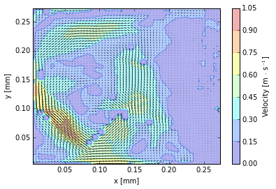
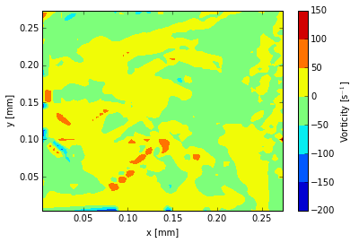

IPython Notebook vecPy example
~~~~~~~~~~~~~~~~~~~~~~~~~~~~~~

.. code:: python

    # %load ../../tests/test0.py
    #!/usr/bin/python
    
    from vecpy import loadvec
    from vecpy import vecplot
    from vecpy.vecpy import vec
    import matplotlib.pyplot as plt
    %matplotlib inline
    
    test_dir = "../../tests/data"
    lst = loadvec.read_directory(test_dir)
    data = loadvec.get_data(lst[3],test_dir)
    dt = loadvec.get_dt(lst[3],test_dir)
    x,y,u,v,chc = loadvec.vecToMatrix(data)
    vec = vec(x,y,u,v,chc,dt,lUnits='mm',tUnits = 's')
    
    
    resolution = 1.0/71.96 #[mm/px]
    vec.rotate(-90)
    vec.scale(resolution)
    
    plt.figure()
    vecplot.genQuiver(vec)
    
    
    plt.figure()
    vecplot.genVorticityMap(vec)
    

.. parsed-literal::

    0.673728460256 0.549680377988 0.00434241939967 0.00434241939967

