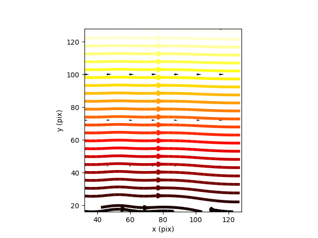

===================
Tutorial
===================

1. Install `pivpy` from PYPI::

	pip install pivy

2. In Python command shell::

	from pivpy import io, pivpy, graphics
	import matplotlib.pyplot as plt

	df = io.create_sample_dataset()
	df.piv.average
	graphics.quiver(df.piv.average,streamlines=True)
	plt.show()
	
	
And the result should look like: 

	
