# PIVPy Feature Gallery

A visual reference showcasing the post-processing, coherent structure identification, turbulence statistics, and visualization features available in **PIVPy**.

All examples below use the exact same reproducible synthetic flow benchmark: a 16-frame 2D turbulent vortex wake on a $64 \times 64$ grid with ground-truth vortices and shear layers.

```python
import pivpy.pivpy  # registers the .piv accessor
from pivpy import synthetic

# Standard reproducible benchmark field
ds = synthetic.multivortex(n_frames=16, n=64, n_vortices=6, seed=42)
```

---

## 1. Kinematics & Velocity Gradients

Compute spatial derivatives and derived kinematic fields directly from velocity components $(u, v)$.

=== "Velocity Magnitude"
    The Euclidean speed $|\mathbf{u}| = \sqrt{u^2 + v^2}$ rendered as a background contour with overlaid velocity vectors and a reference arrow key.

    ```python
    fig, ax = ds.piv.plot(background="mag", cmap="viridis", skip=2)
    ```

    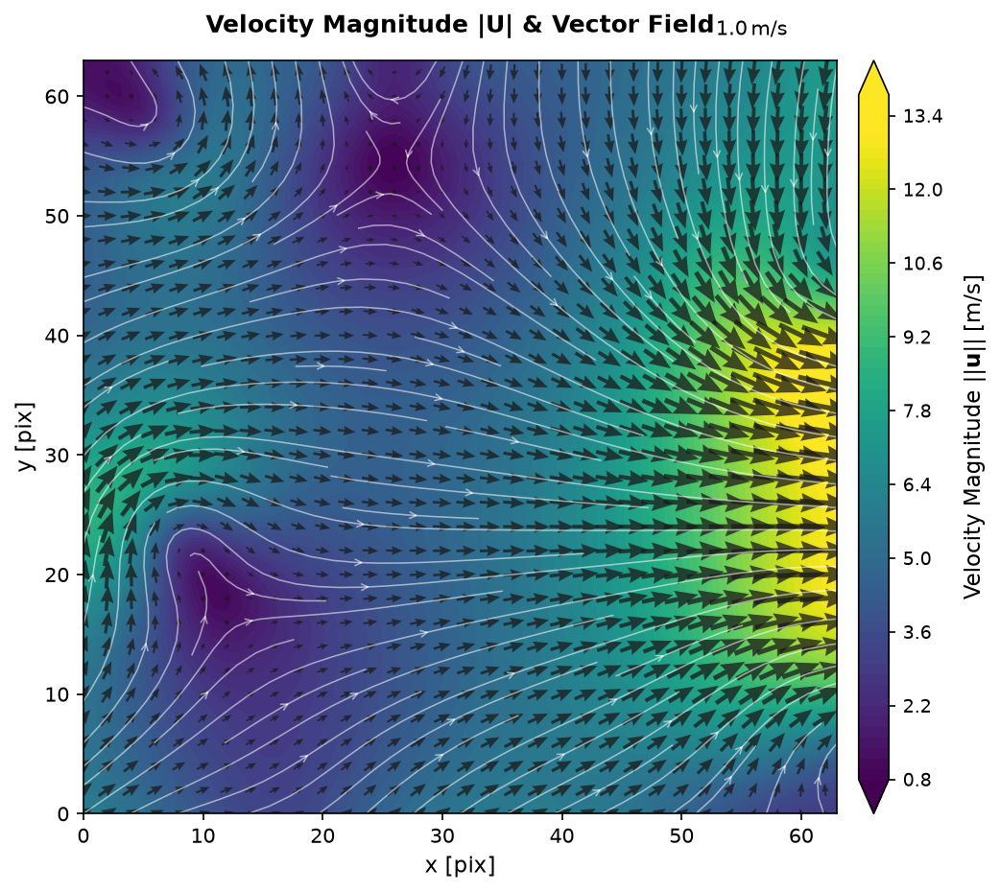{ width="80%" }

=== "Vorticity Field"
    Out-of-plane vorticity $\omega_z = \frac{\partial v}{\partial x} - \frac{\partial u}{\partial y}$. Also available via noise-robust closed-contour circulation (`method="circulation"`).

    ```python
    fig, ax = ds.piv.plot(background="vorticity", cmap="coolwarm", skip=2)
    ```

    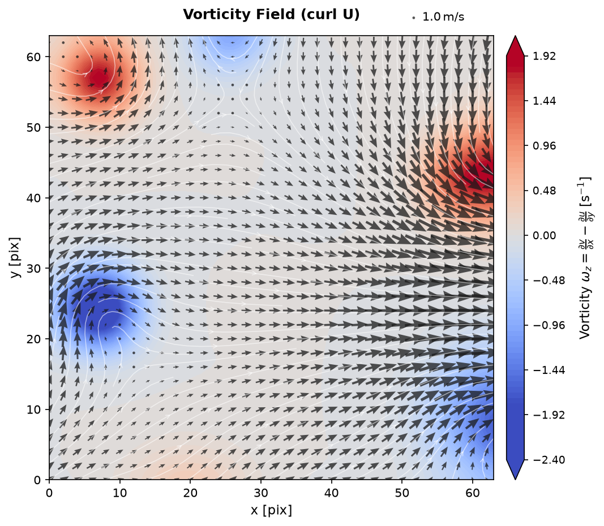{ width="80%" }

=== "Divergence"
    Two-dimensional velocity divergence $\nabla \cdot \mathbf{u} = \frac{\partial u}{\partial x} + \frac{\partial v}{\partial y}$ (measures 2D out-of-plane expansion/compression in incompressible flows).

    ```python
    fig, ax = ds.piv.plot(background="divergence", cmap="bwr", skip=2)
    ```

    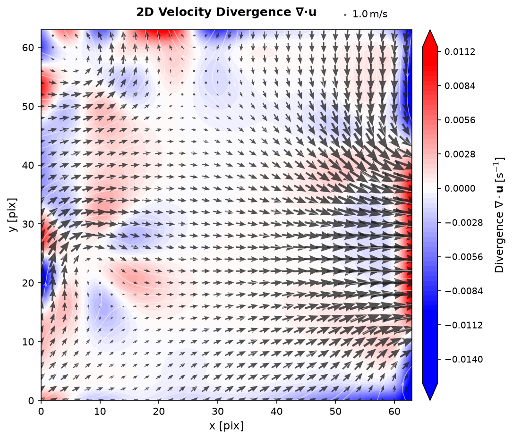{ width="80%" }

=== "Shear Strain Rate"
    Scalar shear strain rate magnitude $S_{xy} = \left(\frac{\partial u}{\partial x}\right)^2 + \left(\frac{\partial v}{\partial y}\right)^2 + \frac{1}{2}\left(\frac{\partial u}{\partial y} + \frac{\partial v}{\partial x}\right)^2$.

    ```python
    fig, ax = ds.piv.plot(background="strain", cmap="inferno", skip=2)
    ```

    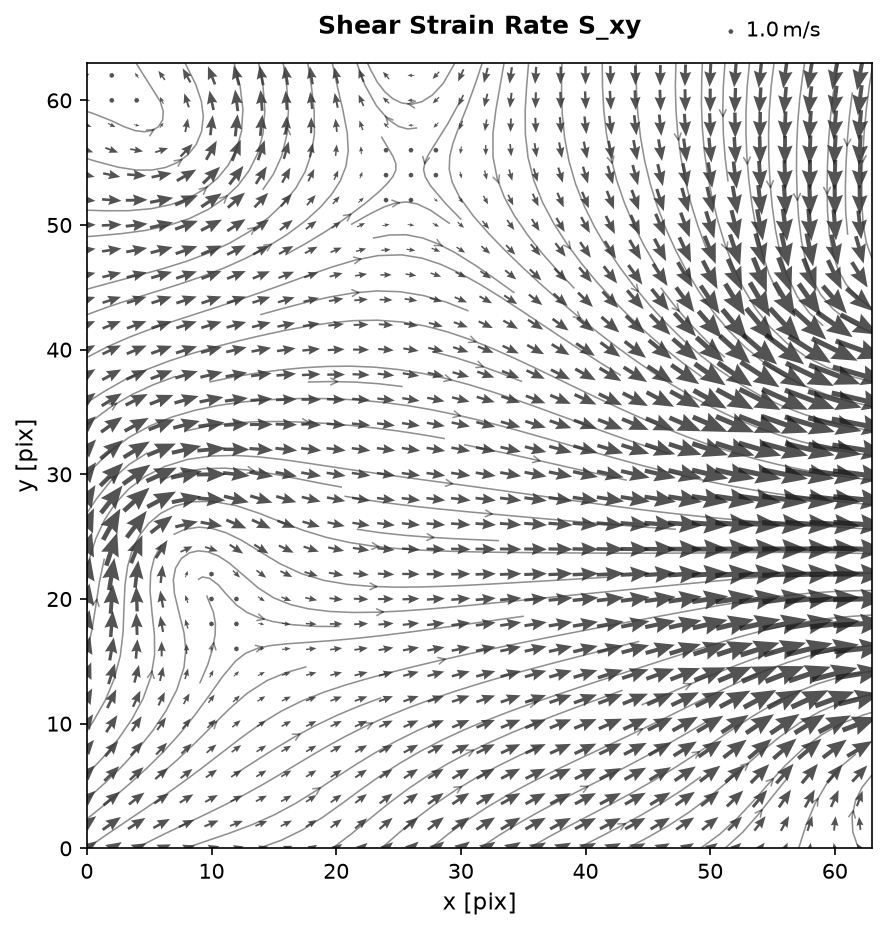{ width="80%" }

=== "Convective Acceleration"
    Material convective acceleration magnitude $|(\mathbf{u} \cdot \nabla)\mathbf{u}| = \sqrt{\left(u \frac{\partial u}{\partial x} + v \frac{\partial u}{\partial y}\right)^2 + \left(u \frac{\partial v}{\partial x} + v \frac{\partial v}{\partial y}\right)^2}$.

    ```python
    fig, ax = ds.piv.plot(background="accel", cmap="magma", skip=2)
    ```

    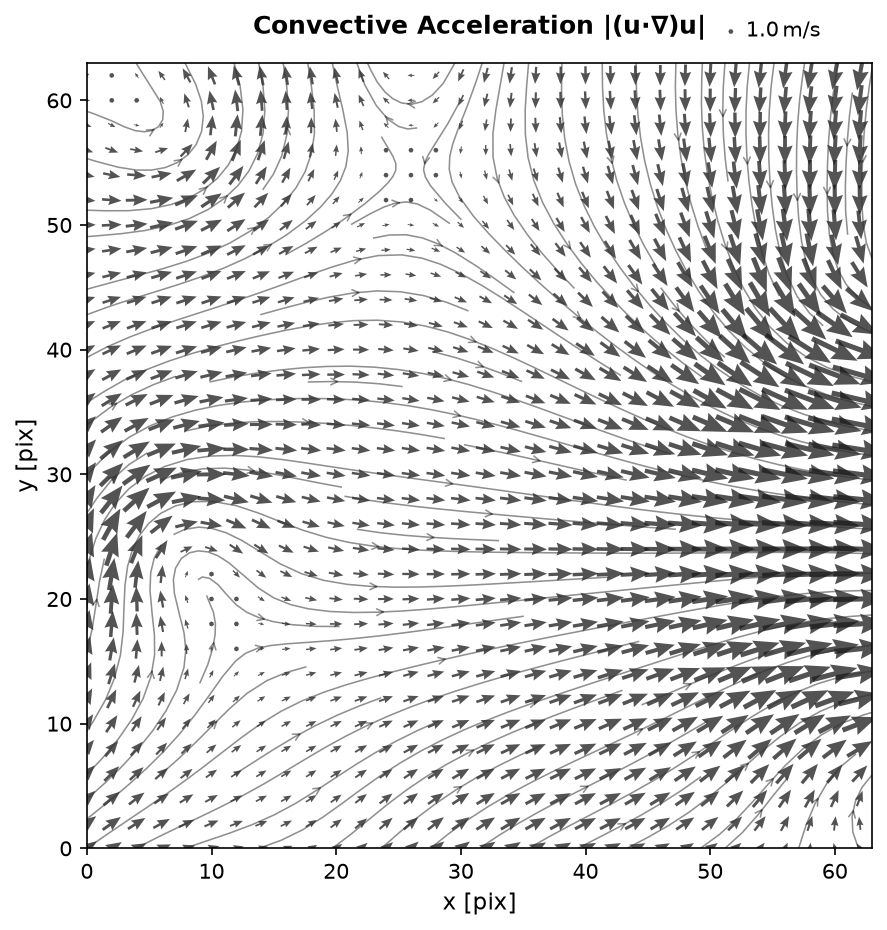{ width="80%" }

---

## 2. Coherent Vortex Identification

Identify and locate coherent vortex cores and vortex boundaries using Galilean-invariant and topological criteria.

=== "$\Gamma_1$ (Vortex Center)"
    Normalized angular momentum criterion (Graftieaux et al., 2001). Reaches $\pm 1$ at ideal vortex centers; $| \Gamma_1 | \ge \frac{2}{\pi} \approx 0.64$ bounds vortex cores.

    ```python
    ds_g1 = ds.piv.gamma1(radius=3, name="gamma1")
    fig, ax = ds_g1.piv.plot(background="gamma1", cmap="coolwarm", clim=(-1.0, 1.0), skip=2)
    ```

    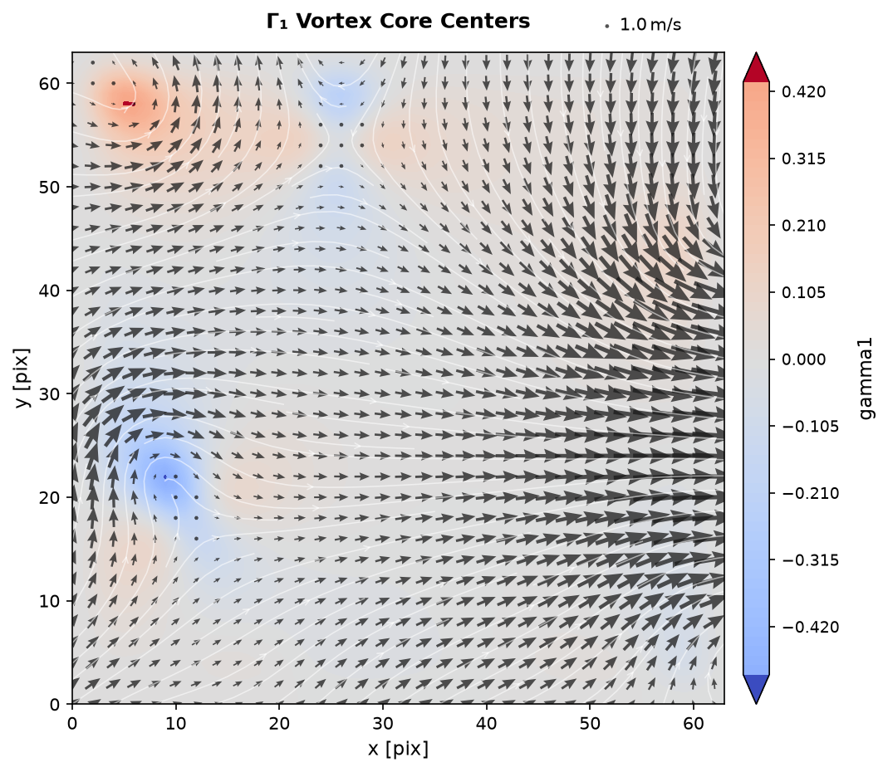{ width="80%" }

=== "$\Gamma_2$ (Vortex Boundary)"
    Galilean-invariant criterion subtracting local convective velocity $\tilde{\mathbf{U}}_P$. Accurately identifies the outer boundary of advecting vortex cores.

    ```python
    ds_g2 = ds.piv.gamma2(radius=3, name="gamma2")
    fig, ax = ds_g2.piv.plot(background="gamma2", cmap="coolwarm", clim=(-1.0, 1.0), skip=2)
    ```

    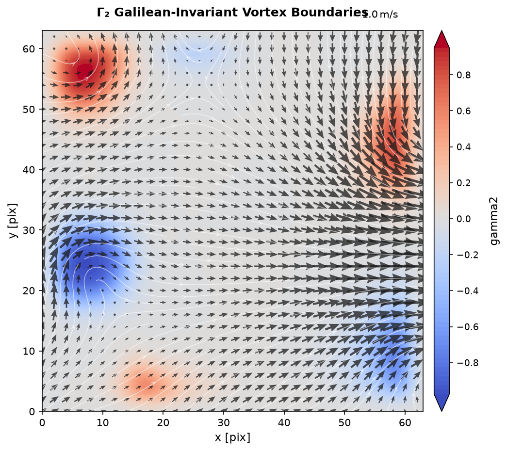{ width="80%" }

=== "$Q$-Criterion"
    Second invariant of the velocity gradient tensor $Q = \frac{1}{2}(\Omega_{ij}\Omega_{ij} - S_{ij}S_{ij})$. Regions with $Q > 0$ indicate rotation dominates over strain rate.

    ```python
    ds_q = ds.piv.q_criterion(name="Q")
    fig, ax = ds_q.piv.plot(background="Q", cmap="PiYG", skip=2)
    ```

    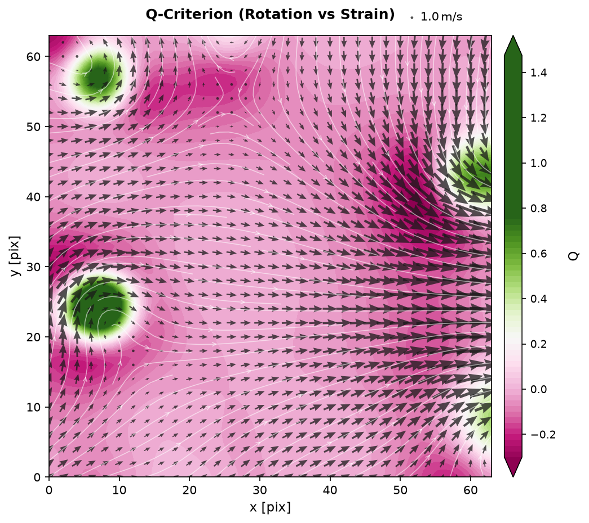{ width="80%" }

=== "Okubo-Weiss ($Q_{OW}$)"
    Separates elliptic (vortex core, $Q_{OW} < 0$) from hyperbolic (shear layer / saddle point, $Q_{OW} > 0$) regions: $Q_{OW} = s_n^2 + s_s^2 - \omega^2$.

    ```python
    ds_ow = ds.piv.okubo_weiss(name="Q_ow")
    fig, ax = ds_ow.piv.plot(background="Q_ow", cmap="PRGn", skip=2)
    ```

    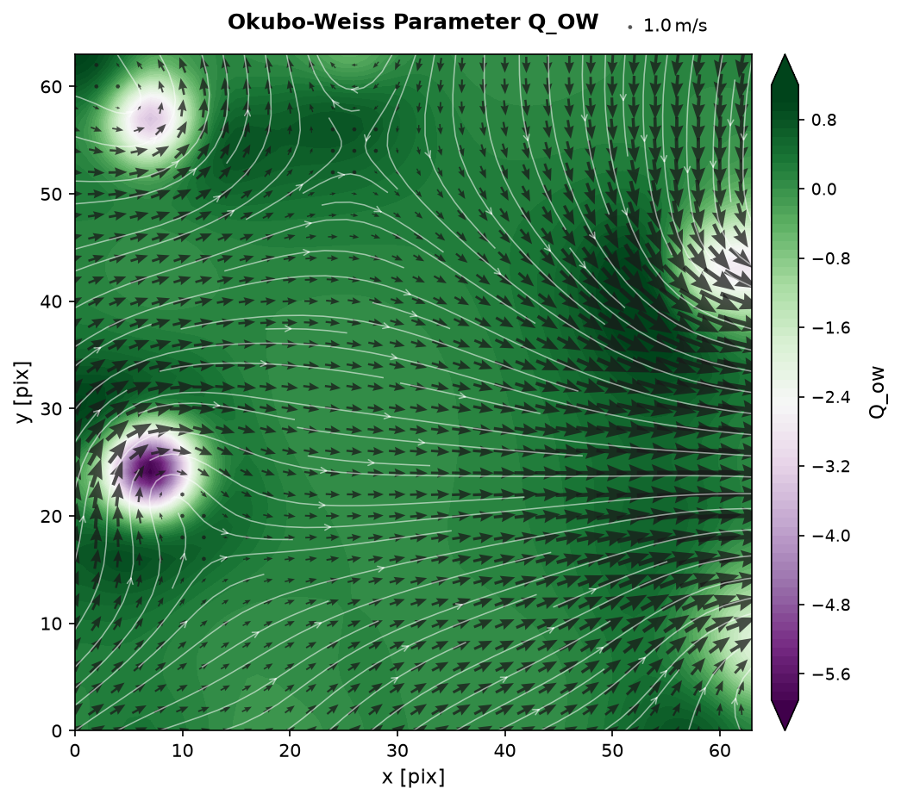{ width="80%" }

---

## 3. Turbulence Statistics & Structure Analysis

Analyze multi-frame time series and ensembles with comprehensive statistical and structural tools.

=== "Turbulent Kinetic Energy (TKE)"
    Time-averaged turbulent kinetic energy $k = \frac{1}{2}(\langle u'^2 \rangle + \langle v'^2 \rangle + \langle w'^2 \rangle)$ computed from ensemble velocity fluctuations.

    ```python
    ds_tke = ds.piv.tke(name="tke_field", time_average=True)
    fig, ax = ds_tke.piv.plot(background="tke_field", cmap="plasma", skip=2)
    ```

    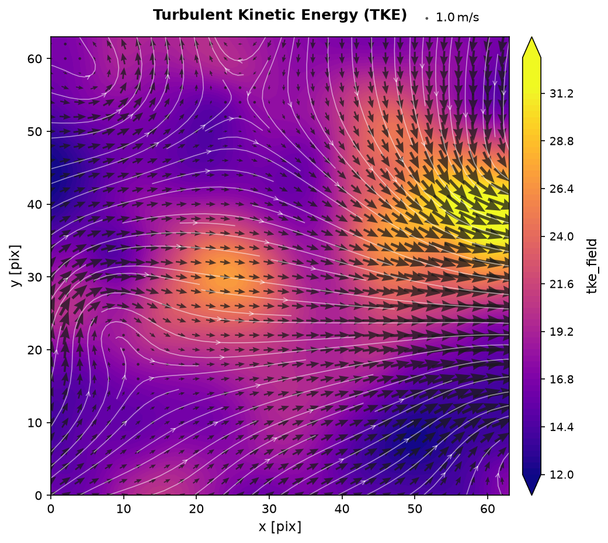{ width="80%" }

=== "Reynolds Shear Stress"
    Time-averaged Reynolds shear stress $-\langle u'v' \rangle$. For full 3D/stereo datasets, `ds.piv.reynolds_stresses()` returns all normal and shear stress components.

    ```python
    ds_rss = ds.piv.reynolds_stress(name="rey_stress")
    fig, ax = ds_rss.piv.plot(background="rey_stress", cmap="bwr", skip=2)
    ```

    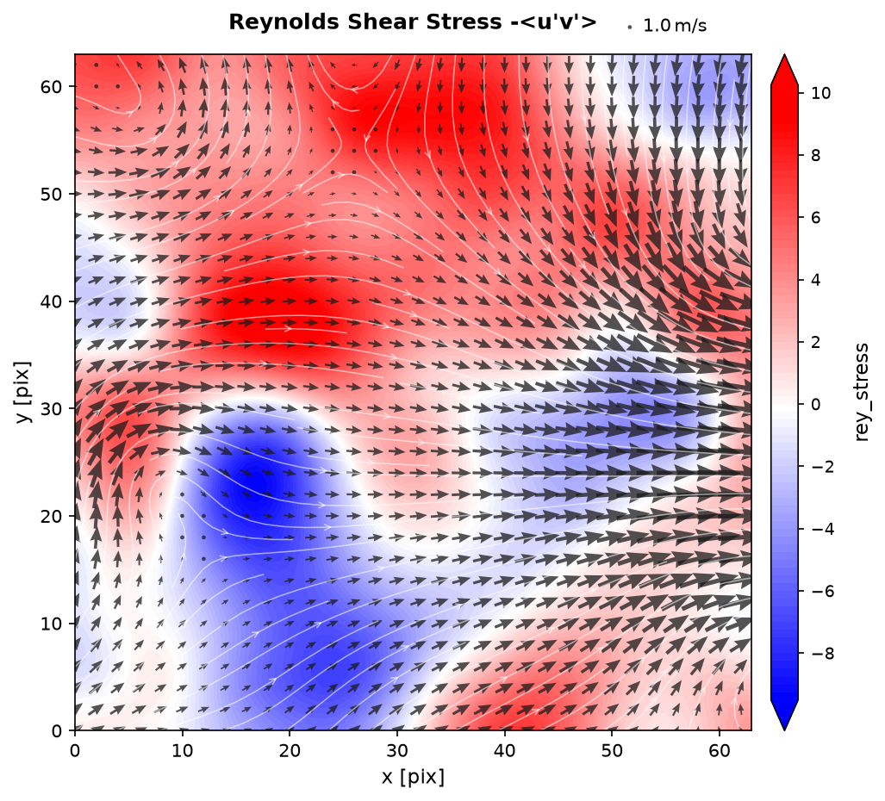{ width="80%" }

=== "Two-Point Spatial Correlation"
    Localized cross-covariance $R_{uu}(\mathbf{x}; \mathbf{x}_{ref}) = \frac{\langle u'(\mathbf{x}) u'(\mathbf{x}_{ref}) \rangle}{\sqrt{\langle u'^2(\mathbf{x})\rangle \langle u'^2(\mathbf{x}_{ref})\rangle}}$ relative to a reference probe point.

    ```python
    x_mid, y_mid = float(ds.x.mean()), float(ds.y.mean())
    corr = ds.piv.two_point_correlation(var_name="u", x_ref=x_mid, y_ref=y_mid, swap_dims=False)

    fig, ax = plt.subplots(figsize=(6, 5))
    cf = ax.contourf(corr.x, corr.y, corr.values, levels=30, cmap="coolwarm")
    ax.plot(x_mid, y_mid, "k+", markersize=14, markeredgewidth=2)
    fig.colorbar(cf, ax=ax, label=r"$R_{uu}$")
    ```

    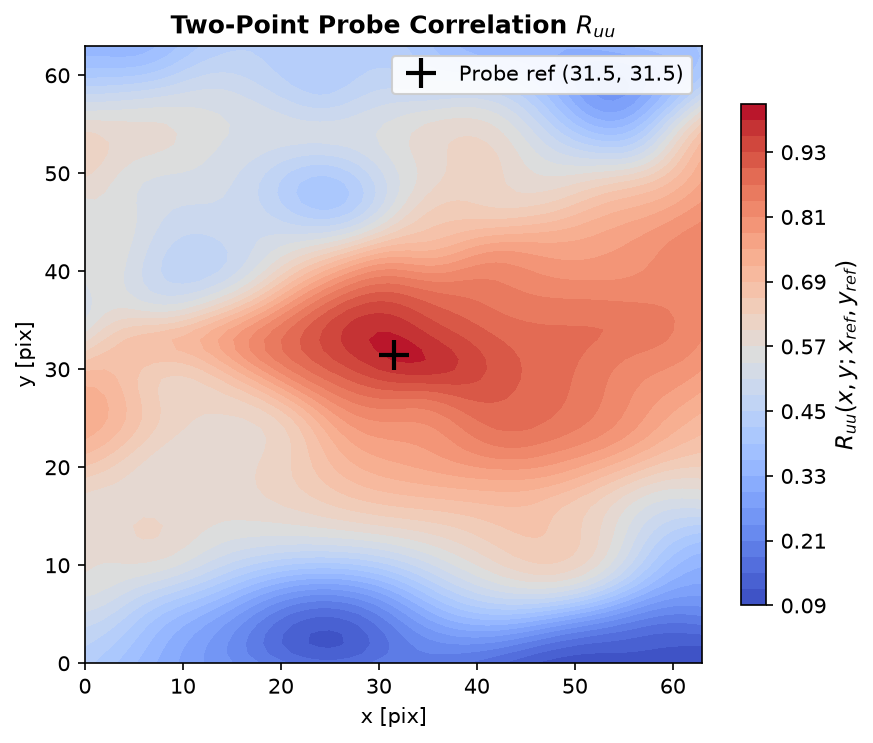{ width="65%" }

=== "Quadrant Analysis"
    Classifies turbulent fluctuations into 4 quadrants ($Q_1$ outward, $Q_2$ ejection, $Q_3$ inward, $Q_4$ sweep) with hyperbolic hole filtering $|u'v'| \ge H |\langle u'v' \rangle|$.

    ```python
    qa = ds.piv.quadrant_analysis(x_var="u", y_var="v")
    # Returns Dataset with:
    # qa["fraction"]  -- stress contribution per quadrant
    # qa["duration"]  -- residence frequency per quadrant
    # qa["conditional_u"], qa["conditional_v"] -- conditional means
    ```

    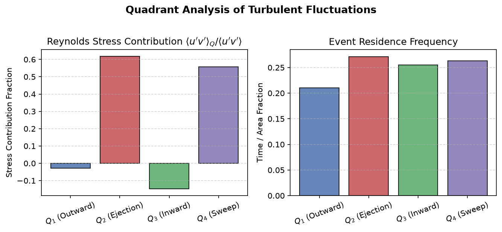{ width="85%" }

=== "Turbulent Energy Spectra"
    2D spatial wavenumber energy spectrum $E(k_x, k_y)$ and radially-integrated 1D spectrum $E(k)$ with theoretical Kolmogorov $-5/3$ reference slope.

    ```python
    spec = ds.piv.energy_spectrum(radial=True, detrend=True)
    # spec["E2D"]: 2D wavenumber energy distribution
    # spec["E_radial"]: 1D radial spectrum over wavenumber k
    ```

    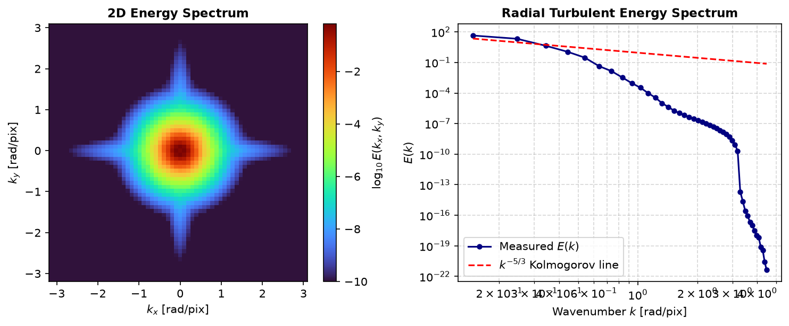{ width="85%" }

=== "Integral Length Scales"
    Multi-model length scale estimation from spatial correlation: $1/e$ cutoff distance, zero-crossing integral, or exponential / bi-exponential fitting.

    ```python
    # 1/e threshold distance (with linear interpolation)
    L_1e = ds.piv.length_scale(variable="u", dim="x", method="1e")

    # Exponential decay fit R(r) = exp(-r / L)
    L_fit = ds.piv.length_scale(variable="u", dim="x", method="fit", fit_model="single")

    # Bi-exponential fit (separates large eddies from fine scales)
    params = ds.piv.length_scale(variable="u", dim="x", method="fit", fit_model="bi")
    ```

---

## 4. Quality Control & Outlier Filtering

Validate, clean, and smooth noisy vector fields.

=== "Normalized Median Test (Outlier Removal)"
    Westerweel & Scarano (2005) universal outlier detection test comparing local residual fluctuation against the median of surrounding neighbors, followed by 2D bi-cubic hole inpainting.

    ```python
    # Identify spurious vectors and replace with bi-cubic interpolation
    ds_cleaned = ds_noisy.piv.clean(threshold=2.0)
    ```

    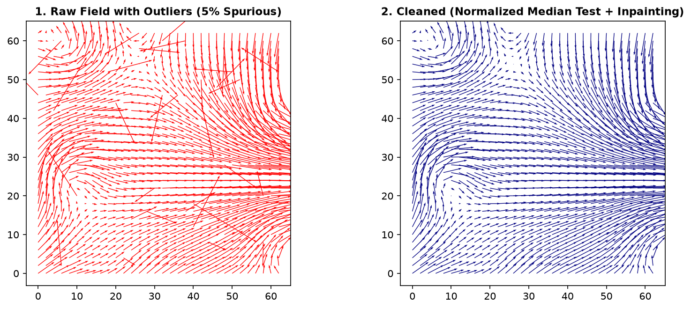{ width="90%" }

=== "Savitzky-Golay & B-Spline Smoothing"
    1D Savitzky-Golay polynomial filtering and B-Spline smoothing along arbitrary coordinate dimensions (`x` or `y`), with support for analytical derivatives (`deriv=1` for noise-free gradients).

    ```python
    # 1D Savitzky-Golay filter along x (window=5, polynomial degree=2)
    u_smooth = ds.piv.smooth_savgol(var_key="u", dim="x", window_length=5, polyorder=2)

    # 1D B-spline analytical differentiation: du/dy without numerical noise
    dudy = ds.piv.smooth_spline(var_key="u", dim="y", deriv=1)
    ```

---

## 5. Flow Visualization Modes

Render publication-ready vector fields and flow trajectories with customizable density and coloring.

=== "Flow Streamlines"
    Streamlines tracing instantaneous velocity trajectories, colored by velocity magnitude or any scalar field.

    ```python
    speed = np.sqrt(ds["u"].isel(t=0)**2 + ds["v"].isel(t=0)**2).values
    fig, ax = ds.piv.streamplot(color=speed, cmap="plasma", density=1.2)
    ```

    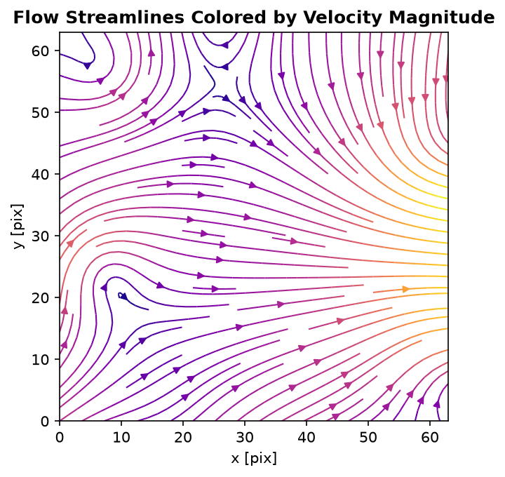{ width="70%" }

=== "Streamlines over a Scalar Field"
    Smooth `RdBu_r` field under thin black streamlines with small direction arrows, no axes, one shared colour scale across panels. Synthetic separated flow (analytic, not a measurement); the field is built in `examples/streamscal_separated_flow.py`.

    ```python
    fig, axs = graphics.streamscal_panels([strong, weak], scalar="u", figwidth=12)
    ```

    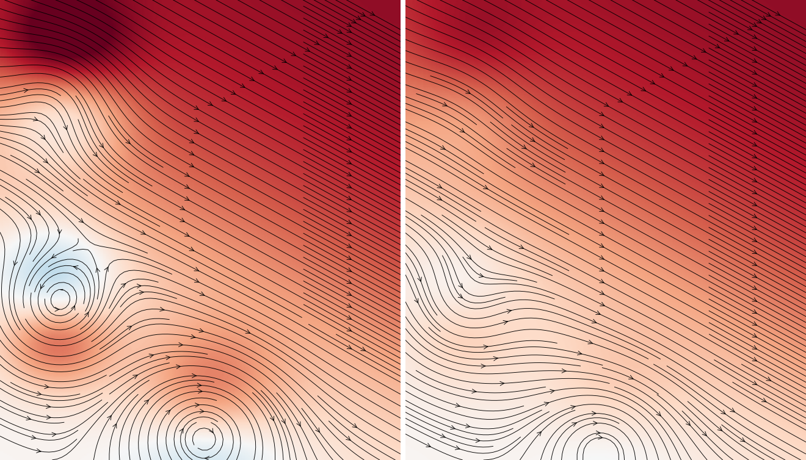{ width="90%" }

=== "Interactive Movie & Animation"
    High-performance animation updating vector artists (`quiver.set_UVC`) in place, exportable to `.mp4` or `.gif`.

    ```python
    # Interactive FuncAnimation
    anim = ds.piv.animate(background="vorticity", skip=2, interval=60)

    # Direct video exporter
    ds.piv.to_movie("vortex_wake.mp4", background="vorticity", fps=15)
    ```

---

## Quick Reference Summary

| Feature Category | Accessor Method | Primary Return | Typical Use Case |
| :--- | :--- | :--- | :--- |
| **Composite Visualization** | `ds.piv.plot()` | `(Figure, Axes)` | One-line publication-ready flow figure with background, arrows, key |
| **Vorticity / Curl** | `ds.piv.vorticity()` | `Dataset` | Fluid rotation rate ($\omega_z = \partial v/\partial x - \partial u/\partial y$) |
| **Streamlines** | `ds.piv.streamplot()` | `(Figure, Axes)` | Flow trajectories and recirculation visualization |
| **Vortex Core Center** | `ds.piv.gamma1()` | `Dataset` | Normalized angular momentum ($\Gamma_1 \approx \pm 1$ at centers) |
| **Vortex Boundary** | `ds.piv.gamma2()` | `Dataset` | Galilean-invariant vortex boundary detection |
| **Rotation vs Strain** | `ds.piv.q_criterion()` | `Dataset` | Second invariant $Q$ (coherent vortices vs shear layers) |
| **Kinetic Energy** | `ds.piv.kinetic_energy()` | `Dataset` | Instantaneous kinetic energy field $\frac{1}{2}(u^2 + v^2)$ |
| **Turbulent Kinetic Energy** | `ds.piv.tke()` | `Dataset` | Time-averaged or instantaneous fluctuation energy $\frac{1}{2}\sum \langle u_i'^2 \rangle$ |
| **Reynolds Stresses** | `ds.piv.reynolds_stresses()` | `Dataset` | Multi-component stress tensor ($\langle u'u' \rangle, \langle v'v' \rangle, \langle u'v' \rangle$, etc.) |
| **Fluctuation Products** | `ds.piv.product("u'v'")` | `DataArray` | String-driven fluctuation/raw product parser |
| **Two-Point Correlation** | `ds.piv.two_point_correlation()` | `DataArray` | Localized probe correlation $R_{uu}(\mathbf{x}; \mathbf{x}_{ref})$ |
| **Integral Length Scale** | `ds.piv.length_scale()` | `DataArray` | Eddy length scale via $1/e$, zero-crossing integral, or exponential fit |
| **Quadrant Analysis** | `ds.piv.quadrant_analysis()` | `Dataset` | Burst/sweep classification and Reynolds stress contribution |
| **Outlier Cleaning** | `ds.piv.clean()` | `Dataset` | Westerweel-Scarano normalized median test + bi-cubic inpainting |
| **Profile Smoothing** | `ds.piv.smooth_savgol()` / `smooth_spline()` | `DataArray` | Savitzky-Golay and B-spline filtering & analytical derivatives |
| **Energy Spectrum** | `ds.piv.energy_spectrum()` | `Dataset` | 2D wavenumber $E(k_x, k_y)$ and 1D radial $E(k)$ spectra |
