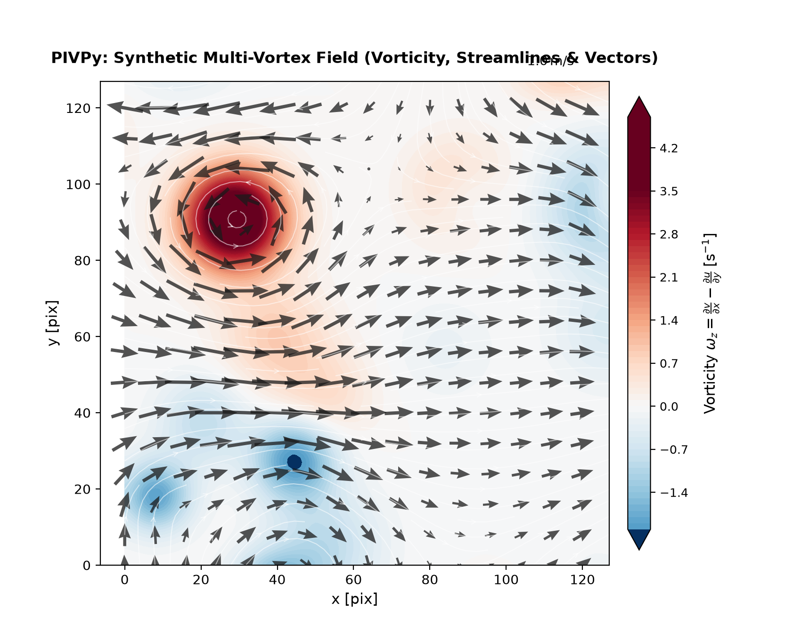
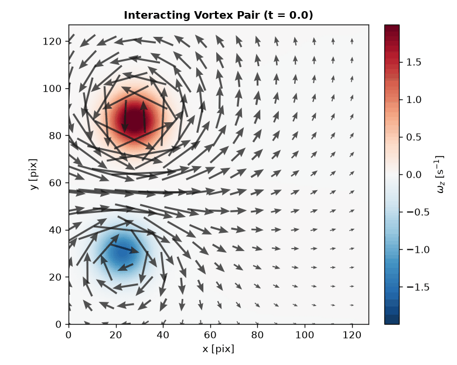
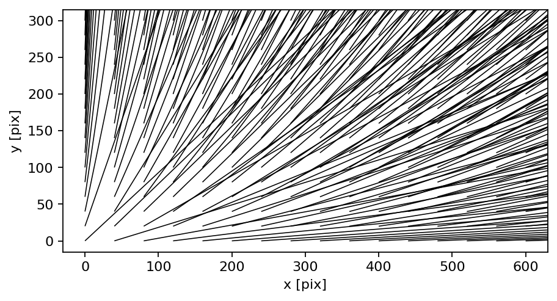
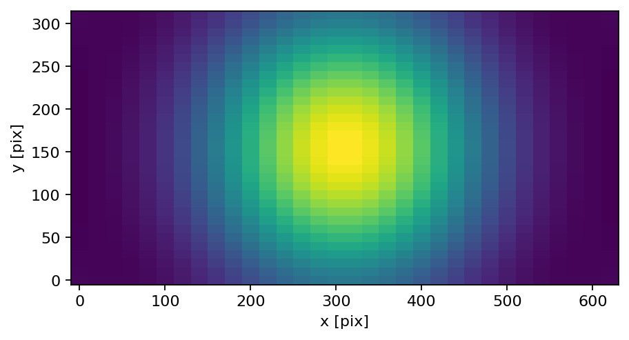
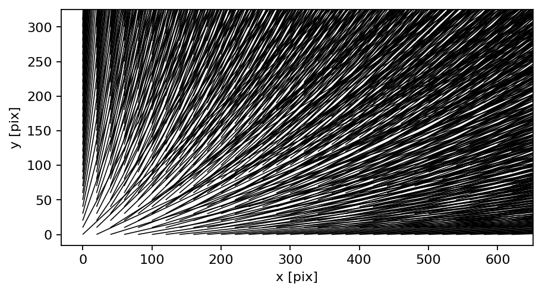
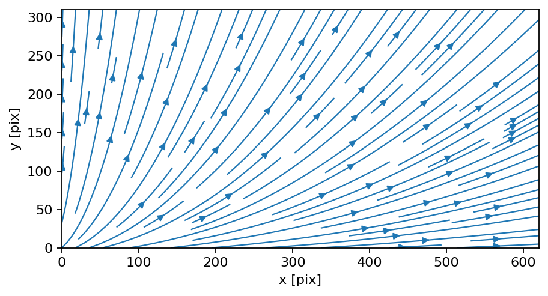

# PIVPy Visualization & Animations

PIVPy provides an intuitive, publication-ready visualization and animation suite for particle image velocimetry (PIV) vector fields and derived flow diagnostics.

## Overview

The primary visualization entry points are:

- `pivpy.graphics.plot` (and `xarray.Dataset.piv.plot`):
  High-level zero-effort publication-quality figure combining smooth scalar fluid contours (vorticity, speed, KE), streamlines, auto-scaled vector arrows, colorbar, and reference arrow key.
- `pivpy.graphics.animate` (and `xarray.Dataset.piv.animate`):
  High-performance interactive and exportable flow animations using in-place vector artist updates (`quiver.set_UVC`) and dynamic fluid gradient tracking.
- `pivpy.graphics.quiver` / `xarray.Dataset.piv.quiver`:
  Clean vector quiver plots with subsampling, scaling, and custom arrow colors.
- `pivpy.graphics.streamplot` / `xarray.Dataset.piv.streamplot`:
  Flow streamlines tracing instantaneous flow trajectories.
- `pivpy.graphics.showf` / `xarray.Dataset.piv.showf`:
  PIVMat-compatible multi-purpose field viewer.
- `pivpy.graphics.to_movie` / `xarray.Dataset.piv.to_movie`:
  Direct batch movie file exporter for time-series datasets.

## Try it live

The two cells below run right here in the page (via [marimo](https://marimo.io) +
Pyodide) -- drag the slider and the plot redraws immediately.

```python {marimo}
import micropip
await micropip.install("pivpy")

import marimo as mo
import matplotlib.pyplot as plt
import pivpy.pivpy  # registers Dataset.piv accessor
from pivpy import synthetic

ds = synthetic.multivortex(n_frames=1, n=64, n_vortices=8, two_d=True, seed=42)
blur_slider = mo.ui.slider(0.0, 4.0, step=0.25, value=1.5, label="background blur (sigma)")
blur_slider
```

```python {marimo}
fig, ax = ds.piv.plot(blur=blur_slider.value, title=f"blur={blur_slider.value}")
fig.gca()
```

## High-Level Plotting (`ds.piv.plot`)

Zero-effort publication-grade visualization out-of-the-box:

```python
import matplotlib.pyplot as plt
import pivpy.pivpy  # registers Dataset.piv accessor
from pivpy import synthetic

# Load data or generate a synthetic 2D turbulence field
ds = synthetic.multivortex(n_frames=1, n=128, n_vortices=8, two_d=True, seed=42)

# Render with one call
fig, ax = ds.piv.plot()
plt.show()
```

{ width="80%" }

### Customizing Visual Layers

All layers (background contour, quiver arrows, streamlines, color limits, Gaussian smoothing) can be tailored or toggled:

```python
# Velocity magnitude background with vectors only (no streamlines)
fig, ax = ds.piv.plot(
    background="mag",       # 'vorticity' (default), 'mag', 'ke', 'divergence', or None
    streamlines=False,      # toggle flow streamlines
    quiver=True,            # toggle velocity vectors
    blur=1.5,               # Gaussian smoothing sigma for smooth fluid contours
    arrow_scale=0.75,       # custom vector arrow scale
    arrow_color="#1a1a1a",  # custom arrow color
    arrow_alpha=0.8,        # arrow transparency
    title="Velocity Magnitude & Vectors",
)
```

## Flow Animations (`ds.piv.animate`)

### How PIVPy Animations Work

Traditional Matplotlib animations that redraw the axes on every frame can be slow and cause visual flickering. PIVPy implements high-performance artist updating techniques:

1. **In-place Vector Updates**: The velocity quiver artist is initialized once on frame 0. For subsequent time steps, vector components are updated directly in-place via `quiver.set_UVC(U, V)` without recreating artists.
2. **Dynamic Smooth Scalar Fields**: Background fluid scalar fields (such as evolving vorticity or kinetic energy) are rendered as Gouraud-shaded meshes and updated via `mesh.set_array(...)` across frames.
3. **Consistent Global Scaling**: Color limits (`clim`) and arrow scaling are calculated robustly across the entire dataset duration, preventing colorbar jumps and flickering between frames.

### Quickstart Animation Example

```python
import pivpy.pivpy
from pivpy import synthetic

# 1. Generate or load time-series flow data (e.g. interacting vortex pair)
ds = synthetic.vortex_pair(n_frames=24, n=128)

# 2. Create the animation object
anim = ds.piv.animate(interval=80)

# 3. Save as GIF or MP4
anim.save("vortex_pair.gif", writer="pillow")
```

{ width="80%" }

### Displaying in Jupyter and Marimo Notebooks

In interactive environments, display the animation inline as HTML5 video or interactive JS player:

```python
from IPython.display import HTML

anim = ds.piv.animate(interval=80)
HTML(anim.to_jshtml())
```

### Tuning Animation Parameters

The `pivpy.graphics.animate` function exposes fine-grained control:

```python
anim = ds.piv.animate(
    background="vorticity",          # 'vorticity', 'mag', 'ke', 'divergence', or variable name
    quiver=True,                     # overlay velocity vectors
    blur=1.5,                        # Gaussian smoothing sigma
    skip=8,                          # arrow subsampling step (e.g. every 8th vector)
    arrow_width=0.007,               # shaft width of vector arrows
    arrow_color="#1a1a1a",           # arrow color
    arrow_alpha=0.75,                # arrow opacity
    cmap="RdBu_r",                   # colormap for background
    interval=60,                     # delay between frames in milliseconds (~16 fps)
    repeat=True,                     # loop animation
    title_fmt="Vortex Interaction (t = {t:.2f} s)", # custom dynamic title
)
```

### Saving High-Quality Videos (MP4 / GIF)

You can export animations using Pillow (GIF) or FFmpeg (MP4 / WebM):

```python
from matplotlib.animation import FFMpegWriter, PillowWriter

# High-quality GIF
anim.save("flow.gif", writer=PillowWriter(fps=15))

# High-definition MP4 (requires ffmpeg installed)
anim.save("flow.mp4", writer=FFMpegWriter(fps=24, metadata=dict(artist="PIVPy"), bitrate=2000))
```

## Batch Video Export (`ds.piv.to_movie`)

For very large datasets or out-of-core file sequences on disk where holding full animations in memory is undesirable, use `pivpy.graphics.to_movie` or `pivpy.graphics.imvectomovie`:

```python
# In-memory time series
ds.piv.to_movie("output.mp4", background="vorticity", fps=15)

# Out-of-core disk file sequences
from pivpy.graphics import imvectomovie
imvectomovie("data_run_*.vec", output="run_movie.mp4", background="mag", fps=20)
```

## Gallery of Static Visualizations

| | |
| --- | --- |
|  |  |
|  |  |
