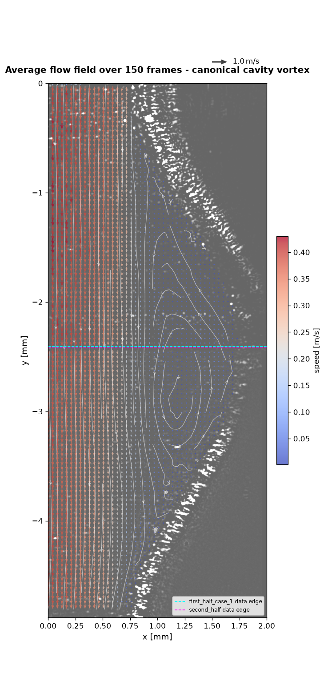
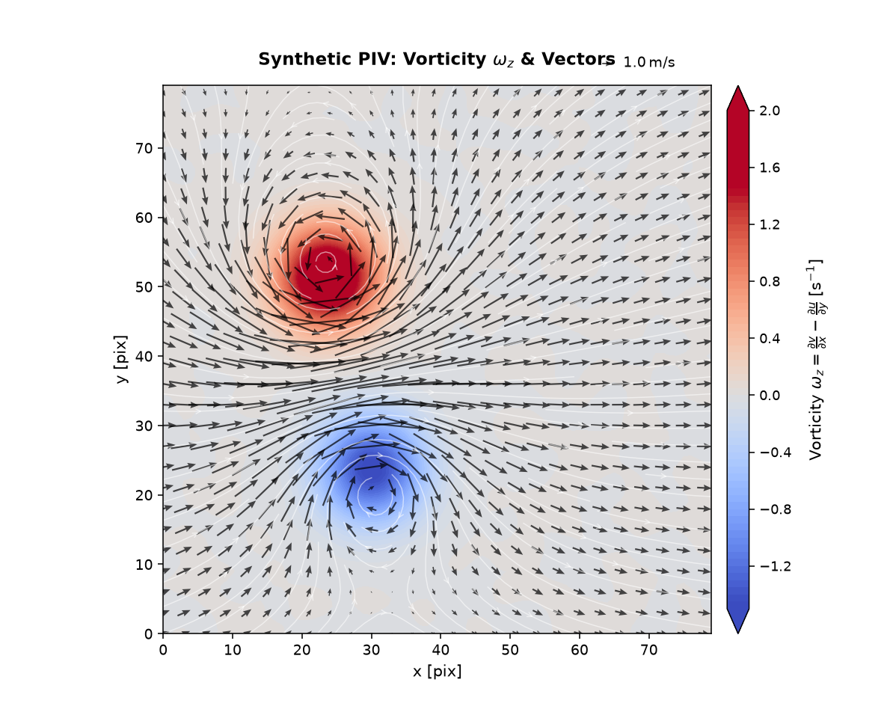

# PIVPy Visualization & Animations

PIVPy provides an intuitive, publication-ready visualization and animation suite for particle image velocimetry (PIV) vector fields and derived flow diagnostics.

## Overview

The primary visualization entry points are:

- `pivpy.graphics.plot` (and `xarray.Dataset.piv.plot`):
  High-level zero-effort publication-quality figure combining smooth scalar fluid contours (vorticity, speed, KE), streamlines, auto-scaled vector arrows, colorbar, and reference arrow key.
- `pivpy.graphics.animate` (and `xarray.Dataset.piv.animate`):
  High-performance interactive and exportable flow animations using in-place vector artist updates (`quiver.set_UVC`) and dynamic fluid gradient tracking.
- `pivpy.graphics.quiver` / `xarray.Dataset.piv.quiver`:
  Clean vector quiver plots with subsampling, scaling, and custom arrow colors.
- `pivpy.graphics.streamplot` / `xarray.Dataset.piv.streamplot`:
  Flow streamlines tracing instantaneous flow trajectories.
- `pivpy.graphics.showf` / `xarray.Dataset.piv.showf`:
  PIVMat-compatible multi-purpose field viewer.
- `pivpy.graphics.to_movie` / `xarray.Dataset.piv.to_movie`:
  Direct batch movie file exporter for time-series datasets.

## Try it live

The two cells below run right here in the page (via [marimo](https://marimo.io) +
Pyodide) -- drag the slider and the plot redraws immediately.

```python {marimo}
import micropip
await micropip.install("pivpy")

import marimo as mo
import matplotlib.pyplot as plt
import pivpy.pivpy  # registers Dataset.piv accessor
from pivpy import synthetic

ds = synthetic.multivortex(n_frames=1, n=64, n_vortices=8, two_d=True, seed=42)
blur_slider = mo.ui.slider(0.0, 4.0, step=0.25, value=1.5, label="background blur (sigma)")
blur_slider
```

```python {marimo}
fig, ax = ds.piv.plot(blur=blur_slider.value, title=f"blur={blur_slider.value}")
fig.gca()
```

## High-Level Plotting (`ds.piv.plot`)

Zero-effort publication-grade visualization out-of-the-box:

```python
import matplotlib.pyplot as plt
import pivpy.pivpy  # registers Dataset.piv accessor
from pivpy import synthetic

# Load data or generate a synthetic 2D turbulence field
ds = synthetic.multivortex(n_frames=1, n=128, n_vortices=8, two_d=True, seed=42)

# Render with one call
fig, ax = ds.piv.plot()
plt.show()
```

{ width="80%" }

### Customizing Visual Layers

All layers (background contour, quiver arrows, streamlines, color limits, Gaussian smoothing) can be tailored or toggled:

```python
# Velocity magnitude background with vectors only (no streamlines)
fig, ax = ds.piv.plot(
    background="mag",       # 'vorticity' (default), 'mag', 'ke', 'divergence', or None
    streamlines=False,      # toggle flow streamlines
    quiver=True,            # toggle velocity vectors
    blur=1.5,               # Gaussian smoothing sigma for smooth fluid contours
    arrow_scale=0.75,       # custom vector arrow scale
    arrow_color="#1a1a1a",  # custom arrow color
    arrow_alpha=0.8,        # arrow transparency
    title="Velocity Magnitude & Vectors",
)
```

## Worked Example: Image Background + Streamlines + Colored Quiver

This is the full pattern for the kind of figure that shows up in real PIV
work: raw camera frame underneath, a colored quiver on top, streamlines to
show the flow topology at a glance, and a correctly-sized colorbar - here
revealing a **canonical recirculation (cavity) vortex** near a wavy channel
wall, averaged over 150 frames to smooth out turbulent fluctuations:

{ width="70%" }

Every argument in the call that produced it, explained:

```python
fig, ax = ds.piv.plot(
    background="image",          # (1) what to paint behind the vectors
    image=raw_frame,             # (2) the actual 2D grayscale array to show
    image_extent=(0, 2.0, -4.9, 0),  # (3) physical (left, right, bottom, top)
    image_cmap="gray",           # (4) colormap for the *image*, not the data
    image_alpha=0.6,             # (5) how much the image shows through
    quiver=True,                 # (6) draw velocity arrows
    color_by="mag",              # (7) color the arrows by speed
    cmap="viridis",              # (8) colormap for whatever is colored (mag here)
    arrow_scale=None,            # (9) None = auto-scaled, no overlap
    arrow_width=0.004,           # (10) shaft thickness
    skip=7,                      # (11) draw every 7th vector (density)
    streamlines=True,            # (12) trace flow topology - this is what
                                  #      actually reveals the vortex cleanly,
                                  #      arrows alone rarely do
    colorbar=True,               # (13) see "Getting the colorbar right" below
    title="Average flow field over 150 frames - canonical cavity vortex",
)

# ax is a normal matplotlib Axes - anything not covered by piv.plot()'s own
# arguments is just ordinary matplotlib on top of the returned (fig, ax):
ax.axhline(-2.41, color="cyan", linewidth=1.0, linestyle="--", label="camera A edge")
ax.axhline(-2.42, color="magenta", linewidth=1.0, linestyle="--", label="camera B edge")
ax.set_xlim(0, 2)
ax.legend(fontsize=7, loc="lower right")
```

**Row-by-row reasoning:**

1. **(1)-(5) `background="image"` family** - use this whenever you have the
   real camera frame (or a photo, a schematic, anything raster) and want
   vectors drawn on top of it, instead of a synthetic scalar field like
   vorticity. `image_extent` must be given in the *same physical units* as
   your `x`/`y` coordinates - if you get the vectors and the picture
   misaligned, this tuple is almost always the culprit. `image_alpha < 1`
   keeps the picture visible without it fighting the arrow colors for
   attention.
2. **(6)-(11) the quiver itself** - `color_by="mag"` (or `"vorticity"`, or
   any variable name in the dataset) colors each arrow by that quantity;
   leave it `None` for plain single-color arrows via `arrow_color`.
   `arrow_scale=None` is almost always the right starting point - it
   auto-picks a scale so neighboring arrows at your chosen `skip` don't
   overlap. Only override it once you've looked at the auto result and know
   which direction (shorter/longer) you want, and be aware that **one
   global scale can't make both a fast primary flow and a much slower
   internal recirculation clearly visible at once** - if the ratio between
   your fastest and slowest region is large (as it is inside a
   recirculation zone), lengthening the scale to see the slow region will
   make the fast region's arrows overlap into an unreadable wash. In that
   case, let the streamlines carry the recirculation's shape (they don't
   have this problem) and treat the arrows as directional context for the
   dominant flow.
3. **(12) `streamlines=True`** - this is doing the real work of showing the
   vortex in the image above. Arrows are inherently a "one sample point at
   a time" view; streamlines integrate the field and reveal closed
   recirculation loops that are easy to miss by eye in a quiver plot alone.
4. **(13) Getting the colorbar right** - `colorbar=True` (the default) is
   almost always what you want, and as of this release it's safe to leave
   on even when you set *both* `background=` and `color_by=` to the same
   quantity (e.g. both `"mag"`) - `plot()` now detects that and only draws
   one colorbar instead of two redundant ones stacked on top of each
   other. It's also now sized to match your axes' *actual rendered* height
   regardless of aspect ratio, so a tall, narrow channel or a wide, short
   wake no longer gets a colorbar several times taller (or shorter) than
   the plot itself - previously this required manually replacing
   `colorbar=True` with `colorbar=False` and drawing your own. If you
   *do* want two colorbars (e.g. `background="vorticity"` colored one way,
   `color_by="mag"` colored another), that still works exactly as before -
   the redundancy check only fires when they'd actually show the same
   thing.

## Using marimo for Interactive Parameter Tuning

Static code-and-rerun is fine for a final figure, but tuning `skip`,
`arrow_scale`, `background`, or a colormap by trial and error is much
faster with live sliders than by editing and re-running a script by hand.
[marimo](https://marimo.io) notebooks are a natural fit for this because
every cell re-runs automatically when a slider it depends on changes - you
drag, the plot redraws, no "run cell" click needed.

A minimal tuning panel for `ds.piv.plot()`:

```python {marimo}
import marimo as mo

cmap_dd = mo.ui.dropdown(
    options=["viridis", "plasma", "coolwarm", "turbo"], value="viridis", label="colormap"
)
background_dd = mo.ui.dropdown(
    options=["mag", "vorticity", "ke", "none"], value="mag", label="background"
)
skip_slider = mo.ui.slider(1, 20, value=8, step=1, label="arrow skip (density)")
mo.vstack([cmap_dd, background_dd, skip_slider])
```

```python {marimo}
fig, ax = ds.piv.plot(
    background=None if background_dd.value == "none" else background_dd.value,
    cmap=cmap_dd.value,
    skip=skip_slider.value,
    color_by=None if background_dd.value != "none" else "mag",
)
fig.gca()
```

A few practical notes from real use:

- **Keep `color_by` and `background` mutually exclusive** unless you
  deliberately want two colorbars (see above) - the pattern
  `color_by=None if background_dd.value != "none" else "mag"` in the second
  cell is the simplest way to enforce that from a single dropdown.
- **Reuse one slider across multiple plot cells** if you're comparing, say,
  a plain scalar-field view and an image-overlay view side by side - marimo
  reruns *every* cell that references the slider, so both plots stay in
  sync automatically without extra wiring.
- **Derive dependent values in their own cell** rather than recomputing
  them inline in the plotting cell - e.g. if you're driving `arrow_scale`
  from a "relative length" slider (see the worked example above for why
  you'd want that), compute the actual scale value in a small cell of its
  own so it's inspectable on its own, and so the plotting cell stays
  readable.
- **`ds.piv.plot(ax=...)`** lets you pre-create the figure at your intended
  final size (`plt.subplots(figsize=(6, 13))` for a tall channel, say)
  *before* calling `plot()`, instead of resizing the returned figure
  afterward - resizing after the fact stretches an already-laid-out figure
  unevenly (colorbar included), while passing a pre-sized `ax=` in gets
  everything scaled correctly from the start.

## Synthetic Data: Freestream + Vortex Pair

`pivpy.synthetic.freestream_vortex_pair()` builds a uniform freestream with one
or more regularized point vortices superimposed - useful for testing
vorticity/Q-criterion code or for a quick demo plot without any real data:

```python
from pivpy import synthetic

ds = synthetic.freestream_vortex_pair(n=80, noise_std=0.05, seed=42)

# pre-filter (denoise) BEFORE differentiating - see tip 1 below
ds = ds.piv.filterf([1.2, 1.2, 0.0]).piv.vorticity()

fig, ax = ds.piv.plot(
    background="vorticity",
    cmap="coolwarm",
    skip=3,
    arrow_color="black",
    arrow_alpha=0.7,
    arrow_width=0.003,
    title=r"Synthetic PIV: Vorticity $\omega_z$ & Vectors",
)
```

{ width="70%" }

**Tricks and tips for nicer `ds.piv.plot()` results, learned while building this
example:**

1. **Pre-filter `u`/`v` before differentiating, not the noisy vorticity after.**
   `ds.piv.filterf([sigma_y, sigma_x, 0.0])` Gaussian-smooths the velocity
   components first, so `.piv.vorticity()` differentiates a clean field
   instead of amplifying pixel-level noise. Smoothing vorticity *after* the
   fact just blurs real gradients along with the noise.
2. **Prefer `.piv.vorticity(method="circulation")` over a hand-rolled
   finite-difference stencil** when the input is noisy - it integrates
   velocity around each cell's border instead of differentiating pointwise,
   so it's less sensitive to noise than even a 4th-order central-difference
   scheme, with no extra pre-filtering step required.
3. **Let `background=` pick its own color limits.** `plot()` already clips to
   a symmetric, percentile-based `clim` for diverging fields like vorticity -
   more robust than `vmax=np.max(np.abs(w))`, which one bad outlier vector can
   blow up.
4. **`background="vorticity"` reuses an already-computed `w`** if one exists
   in the dataset (as it does above, after `.piv.vorticity()`) instead of
   recomputing it - compute it once, plot it as many times as needed.
5. **Keep circulation strengths independent of grid size.** A vortex's
   induced velocity scales as `circulation / radius`; if you scale the
   circulation by the domain size (as an early draft of this example did),
   growing the grid makes the vortices explode relative to `u_inf` instead of
   just adding resolution.

## Flow Animations (`ds.piv.animate`)

### How PIVPy Animations Work

Traditional Matplotlib animations that redraw the axes on every frame can be slow and cause visual flickering. PIVPy implements high-performance artist updating techniques:

1. **In-place Vector Updates**: The velocity quiver artist is initialized once on frame 0. For subsequent time steps, vector components are updated directly in-place via `quiver.set_UVC(U, V)` without recreating artists.
2. **Dynamic Smooth Scalar Fields**: Background fluid scalar fields (such as evolving vorticity or kinetic energy) are rendered as Gouraud-shaded meshes and updated via `mesh.set_array(...)` across frames.
3. **Consistent Global Scaling**: Color limits (`clim`) and arrow scaling are calculated robustly across the entire dataset duration, preventing colorbar jumps and flickering between frames.

### Quickstart Animation Example

```python
import pivpy.pivpy
from pivpy import synthetic

# 1. Generate or load time-series flow data (e.g. interacting vortex pair)
ds = synthetic.vortex_pair(n_frames=24, n=128)

# 2. Create the animation object
anim = ds.piv.animate(interval=80)

# 3. Save as GIF or MP4
anim.save("vortex_pair.gif", writer="pillow")
```

{ width="80%" }

### Displaying in Jupyter and Marimo Notebooks

In interactive environments, display the animation inline as HTML5 video or interactive JS player:

```python
from IPython.display import HTML

anim = ds.piv.animate(interval=80)
HTML(anim.to_jshtml())
```

### Tuning Animation Parameters

The `pivpy.graphics.animate` function exposes fine-grained control:

```python
anim = ds.piv.animate(
    background="vorticity",          # 'vorticity', 'mag', 'ke', 'divergence', or variable name
    quiver=True,                     # overlay velocity vectors
    blur=1.5,                        # Gaussian smoothing sigma
    skip=8,                          # arrow subsampling step (e.g. every 8th vector)
    arrow_width=0.007,               # shaft width of vector arrows
    arrow_color="#1a1a1a",           # arrow color
    arrow_alpha=0.75,                # arrow opacity
    cmap="RdBu_r",                   # colormap for background
    interval=60,                     # delay between frames in milliseconds (~16 fps)
    repeat=True,                     # loop animation
    title_fmt="Vortex Interaction (t = {t:.2f} s)", # custom dynamic title
)
```

### Saving High-Quality Videos (MP4 / GIF)

You can export animations using Pillow (GIF) or FFmpeg (MP4 / WebM):

```python
from matplotlib.animation import FFMpegWriter, PillowWriter

# High-quality GIF
anim.save("flow.gif", writer=PillowWriter(fps=15))

# High-definition MP4 (requires ffmpeg installed)
anim.save("flow.mp4", writer=FFMpegWriter(fps=24, metadata=dict(artist="PIVPy"), bitrate=2000))
```

## Batch Video Export (`ds.piv.to_movie`)

For very large datasets or out-of-core file sequences on disk where holding full animations in memory is undesirable, use `pivpy.graphics.to_movie` or `pivpy.graphics.imvectomovie`:

```python
# In-memory time series
ds.piv.to_movie("output.mp4", background="vorticity", fps=15)

# Out-of-core disk file sequences
from pivpy.graphics import imvectomovie
imvectomovie("data_run_*.vec", output="run_movie.mp4", background="mag", fps=20)
```

## Gallery of Static Visualizations

| | |
| --- | --- |
|  |  |
|  |  |
|  |  |

See the [worked example](#worked-example-image-background--streamlines--colored-quiver) above and the [synthetic data example](#synthetic-data-freestream--vortex-pair) for the full parameter walkthroughs.
