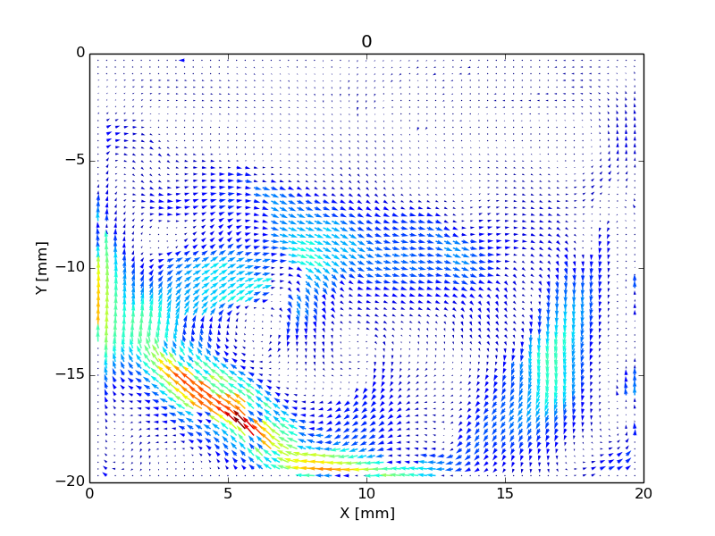

# Tutorial (interactive notebook)

A live, editable [marimo](https://marimo.io) notebook, embedded via the
[marimo.app](https://marimo.app) playground.

!!! note "From the original PIVPy tutorial"
    This is what the classic `averf()` + `showf()` workflow produced -- a
    colored quiver plot of a mean flow field, computed by averaging a
    directory of `.vec` files. Recovered from PIVPy's very first (2014-2019)
    documentation site; try reproducing something similar in the notebook
    below.

    

/// marimo-embed-file
    filepath: docs/source/tutorial.py
    height: 800px
    mode: edit
    show_source: "false"
///
